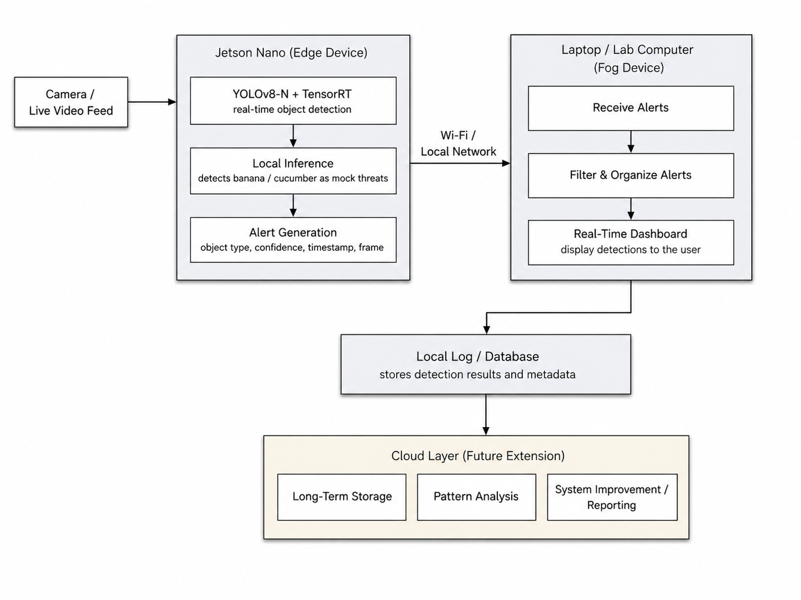

# ThreatSense

## Distributed Threat Detection and Classification System

ThreatSense is a distributed proof-of-concept threat detection system designed for real-time object detection at the edge. The project demonstrates how devices such as a Jetson Nano can process live video locally, detect possible threats, and send alerts to a fog-layer device such as a laptop or lab computer.

For safety in our demo, we use fruits such as bananas and cucumbers as mock weapon-shaped objects instead of real weapons.

## Project Overview

Traditional security camera systems often record video passively or rely on cloud-based processing. This can create problems such as:

- slower response times
- single points of failure
- delayed alerts during emergencies

ThreatSense addresses these issues by performing real-time object detection locally and only sends alert information when a potential threat-like object is detected.

## Use Case

This system is designed for security and public safety environments such as:

- schools
- offices
- parking structures
- apartment complexes
- smart infrastructure environments

In a real emergency, response time is very important. ThreatSense is meant to demonstrate how edge and fog computing can be used to detect potential threats faster and organize alerts more efficiently.

## System Design

## Demo Description

For the proof-of-concept demo, ThreatSense will use a Jetson Nano as the edge device and a laptop or lab computer as the fog device.

The Jetson Nano will run a lightweight YOLOv8-N object detection model optimized with TensorRT. The model will process a live video feed and detect mock threat objects such as bananas and cucumbers.

When an object is detected, the Jetson Nano will send an alert to the fog device. The fog device will display the detection result and log the event.

## Technologies Used

- Jetson Nano
- Camera module or USB webcam
- Laptop or lab computer
- Python
- YOLOv8-N
- TensorRT
- OpenCV
- Local networking
- Alert logging system

## Main Features

- Real-time object detection at the edge
- Mock threat detection using safe objects
- Alert generation with object type, confidence score, timestamp, and frame
- Communication between edge and fog devices
- Real-time alert display
- Detection logging for future analysis
- Scalable design for multiple edge devices

## Project Goals

The main goals of this project are to:

- demonstrate edge-based AI detection
- reduce reliance on cloud processing
- improve alert response time
- reduce unnecessary bandwidth usage
- create a scalable distributed system design
- safely simulate threat detection using harmless objects

## Expected Challenges

Some challenges we expect include:

- running real-time detection on limited Jetson Nano hardware
- reducing false positives
- sending alerts between devices with low delay
- organizing detection results clearly on the fog device
- optimizing the object detection model for performance

## Team Members

Thursday Project Group 2 - ThreatSense

- Ishaan Venkatraman
- Harshini Saraff
- Ryan Pinto
- Adolfo Magallanes
- Moses Avila

## Future Improvements

Possible future improvements include:

- adding support for multiple edge devices
- improving the false positive filtering system
- adding a cloud database for long-term storage
- creating a dashboard for detection history
- adding notification support through email, SMS, or mobile alerts
- training the model on a larger dataset
- improving real-time performance with further model optimization

## Repository Status

This repository is part of our CS 131 project proof-of-concept demo. The current focus is on building the edge-to-fog detection pipeline and demonstrating real-time alert generation.